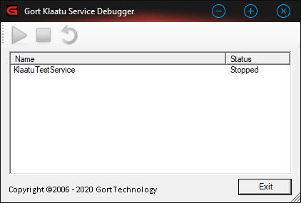

# KlaatuServiceDebugger
A debugging shim for developing, manual testing, and debugging Windows Services.

How to use the Service Debugger.
The service debugger should be used in DEBUG mode only. When properly configured, hitting F5 in Visual Studio will launch a simple windows application with a list of available services...

  

You can start, stop and restart the services as necessary without stopping and re-launching your IDE's debugger. This is very helpful for setting breakpoints and stepping through code as necessary witout the need to kill and reload the entire IDE debugger.

* Click the [Start] button to start the service.
* Click the [Stop] button to stop the service.
* Click the [Restart] button to restart the service.

To configure the ServiceDebugger, reference the ServiceDebugger.dll in your Windows Service project, then modify the service Main() - usually found in the service application's program.cs - as follows...

	static class Program
	{
      static void Main()
      {
        ServiceBase[] ServicesToRun;
		ServicesToRun = new ServiceBase[]
		{
		  new ServiceDebuggerTestService()
		};
		#if (DEBUG)
   	        Akanomi.ServiceDebugger.ServiceLoader.StartServices(ServicesToRun);
        #else
            ServiceBase.Run(ServicesToRun);
        #endif
      }
	}

After adding the ServiceDebugger.dll to your service application, set Visual Studio's debugger to  launch the service application as the default startup app and hit F5 like any normal Windows app.

The ServiceDebugger shall NOT be deployed with the service compiled in release mode. It is compiled out and not required in release mode. 

Neither is it licensed for, or necessary for deployment to end-users.
